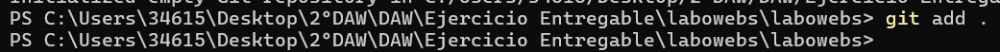
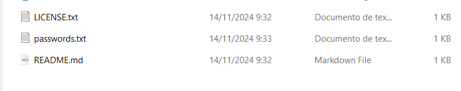
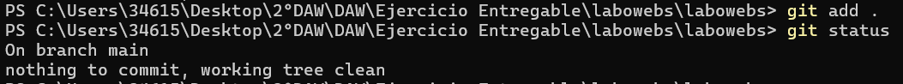
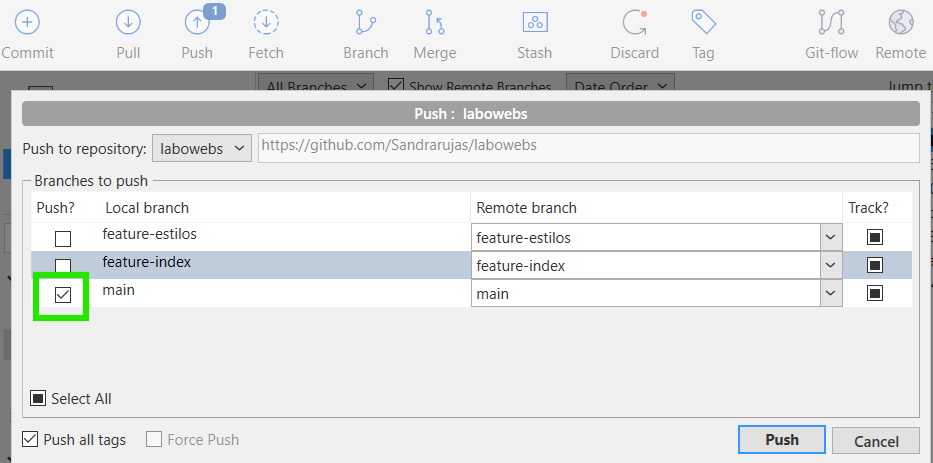
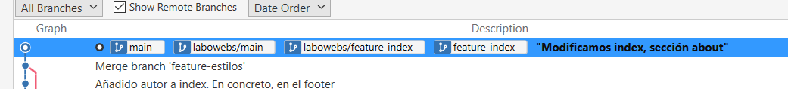
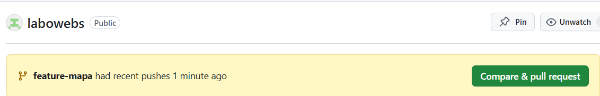
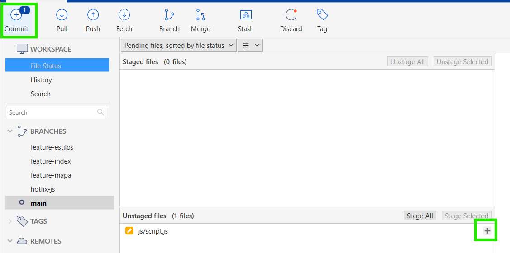

# Ejercicio de Git - proyecto labowebs

> Realizado por Sandra Rujas

[TOC]

# Trabajo en local

1. **Inicializa un nuevo repositorio Git en una carpeta llamada "labowebs" y agrega los**
    **archivos proporcionados en el aula virtual. Renombra la rama master a `main` , si es**
    **necesario. Realiza el primer commit. Muestra el log del repositorio.**

- Si no tenemos creada la carpeta de laboweb deberemos ejecutar los siguientes comandos:

  ```bash
  	$ mkdir labowebs
  	$ cd labowebs
  ```

- Una vez dentro de la carpeta de laboweb, abrimos la terminal y tenemos que ejecutar los siguientes comandos:

  ```bash
  	$ git init
  	$ git add .
  ```

  

  

- Si tu rama aún no se llama main, deberéis ejecutar lo siguiente:

  ```bash
  	$ git branch -m master main
  ```

  

- Realizamos el primer commit:

  ```bash
  	$ git commit -m "Agregando el primer commit: agregando archivos iniciales"
  ```

  

- Y mostramos el log del repositorio:

  ```bash
  	$ git log 
  ```

  

2. **Incluye un fichero .gitignore para que los ficheros `README.md , LICENCE.txt y`**
    **`passwords.txt` sean ignorados por el control de versiones. Realiza el commit y muestra** **los logs del repositorio en una línea.**

- Creamos el archivo en la carpeta:

  

- Añadimos los ficheros citados anteriormente y guardamos:

  

- Ahora volvemos a la consola de comandos para ejecutar lo siguiente:

  ```bash
  	$ git add .gitignore
  	$ git commit -m "Agregamos .gitignore para ignorar los ficheros README.md, LICENSE.txt, passwords.txt"
  ```

  

 

- Como podéis comprobar, me confundí al agregar el mensaje en el commit. Para remediar este error, podemos ejecutar el siguiente comando:

  ```bash
      $ git commit --amend -m "Nuevo mensaje de commit: Configuramos .gitignore para ignorar README.md, 	 LICENSE.txt y password.txt"
  ```


<div style="page-break-after: always; break-after: page;"></div>

- Y por último, mostramos los logs en una sola línea:

  ```bash
  	$ git log --oneline
  ```


  Para seguir con el ejercicio, debemos hacer unos cambios antes:

Deberemos modificar los documentos `index.html, contacto.html y script.js`, eliminando algunas partes que vamos a tener que incluir a continuación. Para ello, deberás borrar lo información necesaria y ejecutar los siguientes comando para poder proseguir con el ejercicio:

  ```bash
  	$ git add 
  	$ git commit -m "Commit extra para eliminar cositas que no debería estar en los documentos del 	index.html, contacto.html y script.js"
  ```


- Mostramos el log en una línea con los nuevos datos que hemos modificado:

  

3. **En el repositorio, crea los archivos `README.md , LICENCE.txt y passwords.txt` con algún contenido. Muestra el estado del repositorio. Muestra el listado de archivos ignorados.**

- Creamos los archivos y les añadimos contenido:

  


<div style="page-break-after: always; break-after: page;"></div>

- Mostramos el estado del repositorio:

  ```bash
  	$ git status
  ```



- Mostramos el listado de los archivos ignorados:

  ```bash
  	$ git ls-files --others -i --exclude-standard
  ```


4. **Crea una rama `feature-estilos` . Cámbiate a ella.**

   ```bash
   $  git checkout -b feature-estilos
   ```


- Modifica el archivo estilos.css :

​		- Propiedad color del body y de h2 : De #2a2a2a a #015743.


​		- Propiedad background-color de header y footer: De #2a75ff a #11b24f


<div style="page-break-after: always; break-after: page;"></div>

- Comprueba el estado del repositorio. Añade los cambios, realiza un commit con el
  mensaje "actualizados estilos a azules".

```bash
 $ git status
 $ git add .
 $ git commit -m "Actualizamos el color del body, h2 y el fondo del header y el footer de colores 		azulados a verdosos."
```


5. **Vuelve a la rama `main` . En el archivo `index.html` añade un comentario donde se indique tu nombre como autor de la página. Comprueba el estado del repositorio. Añade los cambios, realiza un commit con el mensaje ' añadido autor en index'. Muestra los logs del repositorio en una línea, gráficamente y con 'decoración'.**
   
   - Volvemos a la rama main:

   ```bash
   $ git checkout main
   ```
   
   

   - Añadimos comentario con nuestro nombre:

   

   - Volvemos a nuestra terminal y ejecutamos los siguientes comandos:

   ```bash
   $ git add .
   $ git commit -m "añadido autor en index. En concreto, en el footer."
   ```
   
   

   - Mostramos los logs en una línea, gráficamente y con decoración:

   ```bash
   $  git log --oneline --graph --decorate
   ```
   
   

   <div style="page-break-after: always; break-after: page;"></div>

6. **Fusiona la rama `feature-estilos` en la rama `main` . Muestra los logs del repositorio en una línea, gráficamente y con 'decoración'.**
   
   - No aseguramos de que estamos en la rama main antes de todo:
   
   ```bash
   $ git checkout main 
   ```
   
   
   
   - Una vez comprobamos que estamos en dicha rama, fusionamos ambas:

```bash
	$ git merge feature-estilos
```


​	- Mostramos los logs con las especificaciones del enunciado:

```bash
	$ git log --oneline --graph --decorate
```


# Trabajo en remoto

1. **Continúa con el repositorio labowebs . Añade el repositorio a Sourcetree.**

   

   <div style="page-break-after: always; break-after: page;"></div>

   **1:** Le damos a la opción de Add para añadir un repositorio ya existente, en este caso, el nuestro se llama labowebs.

   **2:** Buscamos el repositorio en nuestro ordenador.

   **3:** Pulsamos add para finalmente añadirlo.

   

   

2. **Crea un repositorio remoto y sube al remoto los ficheros de tu repositorio local. Debes subir todas las ramas.**

     Creamos un repositorio en nuestra cuenta de **Github**:

  

- Copiamos la url del nuevo repositorio, que en mi caso es la siguiente: https://github.com/Sandrarujas/labowebs.

- Ahora nos vamos a la aplicación de **Sourcetree** y seguimos los siguientes pasos:

  

​	**1:** Le damos a la opción de Add.

​	**2:** Buscamos la carpeta en nuestro ordenador donde tenemos nuestro ejercicio.

​	**3:** Finalmente le damos a Add. Y nos aparece la siguiente imagen:


<div style="page-break-after: always; break-after: page;"></div>

-  Le damos a la opción de Remote y seguidamente realizamos las siguientes acciones (sigue la flecha):


  

<div style="page-break-after: always; break-after: page;"></div>

- Añadimos un nombre, la URL o Path del repositorio de Git y nuestro username:

  

  

  <div style="page-break-after: always; break-after: page;"></div>

- Debemos comprobar que en **Sourcetree** nos aparece lo siguiente:

  

Ahora es momento de subir los cambios al repositorio de **Git** desde la aplicación:

- En la barra principal, clickamos en Push.
- Seleccionamos todas las ramas (Select All) y le damos al botón de Push.


​        

- Nos vamos a la página de **Git** para comprobar que los cambios han sido realizados correctamente:

  <div style="page-break-after: always; break-after: page;"></div>

3. **Crea una rama `feature-index`. Añade el siguiente código dentro de la `<section class="about">` .Añade los cambios y crea un commit. Sube los cambios al remoto.**

- Creamos la rama:

  

- Añadimos el código a la sección `"about"` (para ello he utilizado Visual Studio Code) y guardamos los cambios (podemos utiilizar Ctl+s para hacerlo de forma rápida):

  
  
  <div style="page-break-after: always; break-after: page;"></div>
  
-  Nos vamos de nuevo a la aplicación y comprobamos que hay un "commit" incompleto:

  

- En la barra principal clickamos encima de "commit" y nos aparece lo siguiente:


- Deberemos darle a la opción de (+) que ves en la foto anterior, para pasar los cambios del área de Staging. A continuación, escribiremos un comentario para el commit (En este caso he puesto lo siguiente "Modificamos index: sección about" y le finalmente le damos al botón de commit.

  

-  Si se produce el commit, deberá aparecer la siguiente información en el panel de **Sourcetree**:


  Ahora, subiremos los cambios al repositorio remoto de **Git**. Seguimos los siguientes pasos: 

- Clickamos Push del panel principal, seleccionamos la rama en la hemos modificado los datos, y le damos al botón de Push.

  

  Resultado:


  

4. **En el repositorio local, fusiona la rama `feature-index` en la rama `main` .**

   

   Otra opción (paso por paso):

   

   

   

   

   Comprobamos en **Github**:

   

   <div style="page-break-after: always; break-after: page;"></div>

5. **Edita el fichero `contacto.html` . Borra unas líneas. Muestra los ficheros con cambios pendientes y las diferencias. Añade los cambios y haz un commit.**
   
     - En este caso, he borrado el header (aparece en la siguiente fotografía):

​              

- Realizamos el "commit" siguiendo los pasos que hemos realizado anteriormente:


-  Por último, realizamos el Push (siguiendo también los pasos que hemos hecho en ejercicios anteriores):

  

  

- Comprobamos en **Git** lo cambios:

  

6. **Te das cuenta del error. Deshaz el commit anterior. Captura el estado actual del repositorio.**

     Le damos botón derecho sobre el commit. Opción de Reserve para deshacer el commit que hemos hecho:

  

  


- Hacemos Push para subir los cambios al repositorio de **Git**:

  

  

- Comprobamos que se ha subido correctamente:

  

  

  <div style="page-break-after: always; break-after: page;"></div>

- Y por último, comprobamos que lo hemos revertido:

  

  

7. **Crea una rama `feature-mapa` . Incluye este código en el archivo `contacto.html` . Añade los cambios. Realiza un commit. Sube los cambios al remoto. Muestra en el remoto los cambios del archivo contacto.html en la rama `feature-mapa`. Asegurarse de que contacto.html queda con TODAS sus líneas.**

- Creamos la rama nueva `"feature-mapa"` y añadimos el código anterior en `"contacto.html"`.


​                                        

- Realizamos el commit:


  


- Como en anteriores acciones, debemos hacer un Push para subir los cambios al repositorio remoto de Git:





8. **En GitHub, en la rama `main` , fusiona la rama `feature-mapa` . Baja los cambios del remoto a local. Deja los dos repositorios sincronizados.**

****  


  


Lo he hecho desde **Sourcetree**, pero desde **Github** tendríamos que seguir los siguientes pasos:

​	**1:**Vamos a nuestro repositorio en Github.

​	**2:** Cambiamos a la rama `main` desde el menú de ramas.

​	**3:** Abrimos un Pull Request desde la rama `feature-mapa` hacia `main`:

- Vamos a la pestaña **Pull Requests**.

- Creamos un nuevo PR seleccionando `feature-mapa` como la rama de origen y `main` como la rama de destino.

- Revisamos los cambios y confirmamos la fusión (merge) si todo está correcto.

  


# Conflictos

1. **Crea una rama `hotfix-js` . Cámbiate a ella. Añade este código en el fichero `script.js`. Confirma el cambio y haz un commit. (Fíjate en los números de línea...)**
   
     
     
     <div style="page-break-after: always; break-after: page;"></div>
     
     - Añadimos el código al fichero de js:
     
     
     
     - Una vez guardamos el fichero de nuevo, nos vamos a **Sourcetree** a realizar el "commit":
     
     
     
     
     
     
     
     <div style="page-break-after: always; break-after: page;"></div>
     
2. **Vuelve a la rama `main` . En el fichero `script.js` en las mismas líneas que en la cuestión anterior, añade el código siguiente. Confirma el cambio y haz un commit.**
   
     - Volvemos a la rama `main`: 
     
     
     
     - Cambiamos el código:
     
     
     
     - En **Sourcetree** realizamos el commit:
     
     
     
     
     
     <div style="page-break-after: always; break-after: page;"></div>
     
     - Como siempre, subimos los cambios también a **Github** a través de un Push:
     
     
     
     
     
3. **Fusiona la rama `hotfix-js` en `main` . Debe producirse un conflicto. Resuélvelo. Cuando termines la resolución del conflicto sube los cambios al remoto - Deja los repositorios sincronizados.**

- Fusionamos las ramas:


- Al darle al botón de Aceptar nos salta el siguiente recuadro mostrándonos que tenemos un conflicto:


- Esto es lo que nos sale en el panel principal de la aplicación:


- Y esto, en el fichero js:


- Desde dicho documento debemos elegir la solución que queremos para nuestro proyecto.

Yo he elegido lo siguiente:

- Primero he comparado los cambios que hay entre ambos y he borrado las líneas que no necesitaba:


<div style="page-break-after: always; break-after: page;"></div>

- Seguidamente, realizamos el último commit:




- Y por último, lo subimos al repositorio remoto:


<div style="page-break-after: always; break-after: page;"></div>

  # Subida de documentación

 En la carpeta del proyecto labowebs añade una carpeta docs . Copia en esa carpeta el fichero markdown y la carpeta con las imágenes. Incluye también el pdf . Añade todo al repositorio. Súbelo al remoto.


